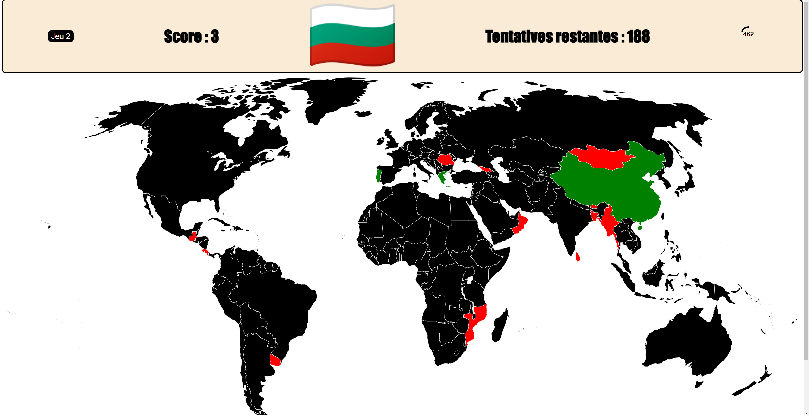
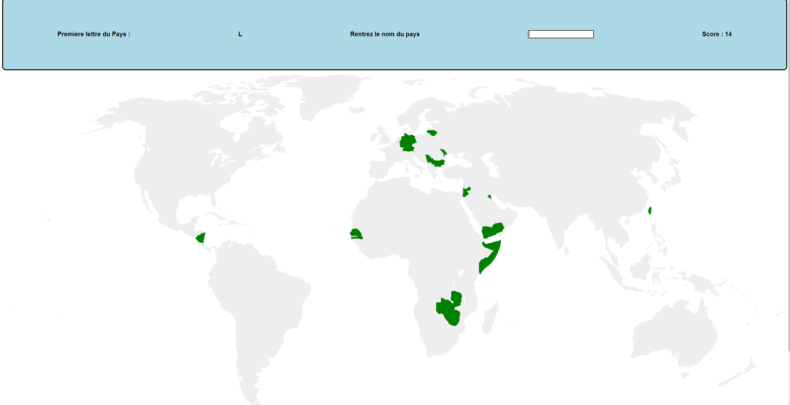

# GuessTheFlag

This is a game made as a project for the Software Engineering class.

The game includes a local auth using mysql and 2 game modes.

---

For the first game, a random flag pulled from the flag api is displayed and you have to click on the map where you think the country is.

If you are right the country will be filled with green and if you are wrong the country where you should've clicked appear as red. You have 3 tries and a there is a time limit.

---

For the second game, a letter will be displayed and you have to enter the name of a country starting by this letter. If you are right the country will be filled with green

There is no limit on the amount of tries, you just have a time limit.

